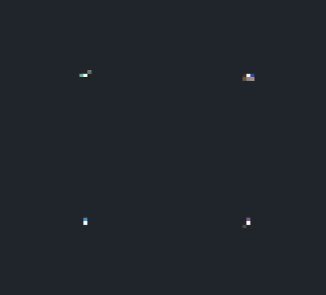
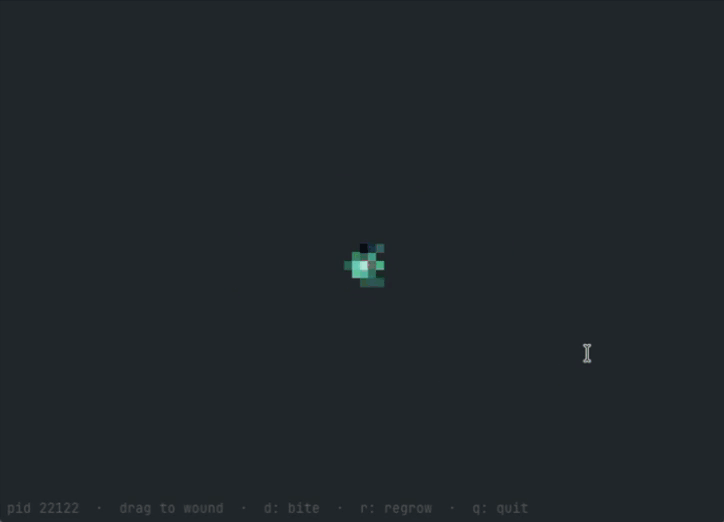

# tardigrade

It is not an image. It is a self-healing mess of weights that lives in your terminal, whose only stable state is the creature itself. Drag the mouse across it and it regrows. `kill -9` its PID and it comes back.



Four creatures ship in the binary. Each one is 96KB of weights: a single rule, run by every cell.

## Install

macOS, via Homebrew:

```bash
brew install --cask smoothyy3/tap/tardigrade
```

Linux and Windows: grab an archive from [releases](https://github.com/smoothyy3/tardigrade/releases), untar it, and drop `tardigrade` somewhere on your `$PATH`. There are no dependencies; it is a single static binary with the weights inside it.

Or with a Go toolchain:

```bash
go install github.com/smoothyy3/tardigrade/cmd/tardigrade@latest
```

## Usage

```bash
tardigrade                  # drag the mouse to wound it, q to quit
tardigrade --creature gecko # or jellyfish, or mouse
tardigrade --screensaver    # wounds and heals itself on a timer, any key exits
```

| key | |
| --- | --- |
| drag | wound it wherever the cursor goes |
| `d` | bite a random chunk out of it |
| `r` | wipe it back to a seed cell and grow again |
| `q` / Esc | quit |



It prints its PID on start, and shows it along the bottom of the screen. Try:

```bash
kill -9 $(pgrep -f 'tardigrade --worker')
```

| flag | default | |
| --- | --- | --- |
| `--screensaver` | off | autonomous damage/heal loop, exits on any keypress |
| `--creature` | `tardigrade` | which built-in creature to grow (`tardigrade`, `gecko`, `jellyfish`, `mouse`) |
| `--fps` | 20 | frames per second |
| `--size` | 56 | grid size in cells; the creature was trained at 56 |
| `--seed` | time | random seed |
| `--weights` | built in | path to a different `.nca` file |

**Use a true-colour terminal.** The creature is drawn in 24-bit colour, and its body is a smooth vertical gradient. A terminal limited to 256 colours (macOS Terminal.app, notably) collapses that onto about 28 palette entries, which looks like speckling across the body and thin horizontal lines through the legs. Nothing is wrong with the creature; you are seeing the palette boundaries. iTerm2, Ghostty, WezTerm, kitty and Alacritty all render it properly.

## How it works

Every cell holds 16 numbers. Once per frame each cell looks at its 3x3 neighbourhood through one learned convolution, runs the result through a two-layer MLP, and adds the answer to itself. That rule is 24k parameters, 96KB and is shared by every cell and **is** the entire creature. There is **no image** of a tardigrade anywhere in the binary; the shape is a fixed point of the rule, which is why cutting a hole in it heals: the surviving cells still run a rule whose stable state is a whole tardigrade.

It is trained offline, in PyTorch, on a pool of partly-grown and deliberately damaged states. Some of those pooled states are left undamaged, which is what makes the shape hold indefinitely rather than slowly starving after a few thousand steps. The Go side does the forward pass by hand, and `internal/nca/model_test.go` pins it to a fixed input/output pair dumped from the PyTorch model.

`kill -9` works because nothing tries to catch it. Running `tardigrade` starts a supervisor that spawns a worker, and the worker is what draws the creature. SIGKILL cannot be handled, so the worker dies mid-frame with no chance to react. The supervisor simply notices that it exited, by whatever means, and starts another one, which grows a new creature from its seed cell. The creature you killed is gone. Something grows back.

## Training your own creature

None of this is needed to *run* the creature. The binary is pure Go with the weights baked in. It is only needed to make a new one.

Training rides on [NCAtorch](https://github.com/mspitzna/NCAtorch): clone it next to this repo, or point `NCATORCH_PATH` at an existing checkout.

```bash
git clone https://github.com/mspitzna/NCAtorch ../NCAtorch
cd ../NCAtorch && uv sync && cd -

python training/train.py --steps 60000         # ~50 min on an RTX 4090
python training/verify.py                      # grows / persists / heals, pass or fail
python training/export_weights.py              # -> assets/tardigrade.nca
```

### Creating your own creature

The creature is the sprite, not the code. Draw an RGBA PNG on a transparent background, no larger than the 56x56 canvas, and point the same three scripts at it:

```bash
python training/train.py --steps 60000 --name newt --target newt.png
python training/verify.py --run training/runs/newt --target newt.png
python training/export_weights.py --run training/runs/newt --out assets/newt.nca \
  --fixture /tmp/newt_fixture.bin
```

Pass `--fixture` for anything that is not the tardigrade. `export_weights.py` also dumps a forward-pass fixture, and its default path is `internal/nca/testdata/forward_case.bin`, the one `internal/nca/model_test.go` checks the Go forward pass against, using the *tardigrade's* weights. Overwrite it with another creature's and that test fails.

Draw it chunky. Nothing thinner than about two cells survives.

Creatures registered in `assets/assets.go` are baked into the binary and picked with `--creature <name>`. A `gecko`, a `jellyfish` and a `mouse` ship alongside the tardigrade. `--weights <file>` loads an `.nca` from disk instead.

## License

MIT
